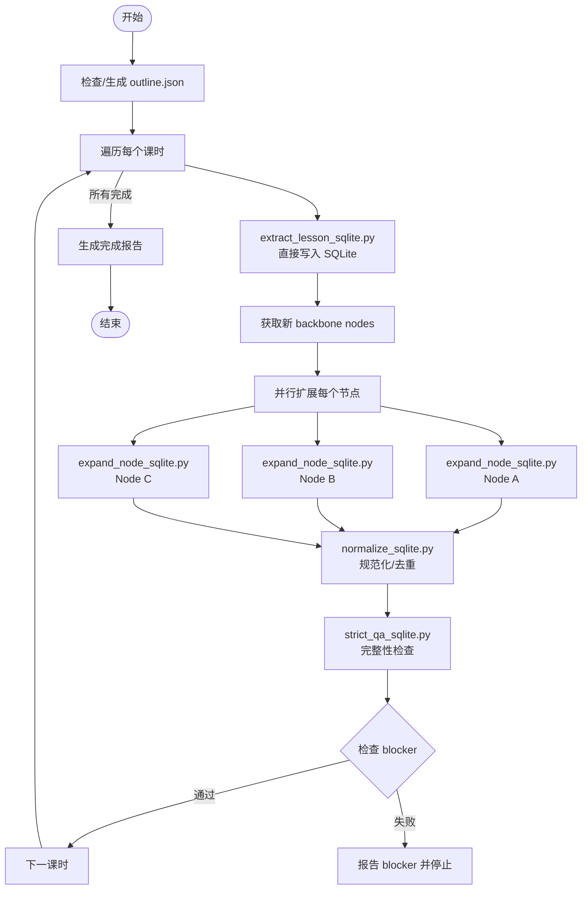

# Chapter Extract - SQLite-Native Implementation

**架构模式**: SQLite-First (无 JSONL 中间文件)

## 核心变更

### 旧流程 (File-First)
```
提取技能 → JSONL 文件 → import_to_sqlite.py → SQLite
  ↑______________↓
  需要写磁盘、格式转换、容易出错
```

### 新流程 (SQLite-Native)
```
提取技能 → 直接 INSERT → SQLite
  ↑
  内存中生成，直接写入
```

## 命令行接口

### 1. 提取课时

```bash
python scripts/extract_lesson_sqlite.py \
  --batch-anchor struct:chem-grade8-shanghai-all-in-one:lesson:1-1-1 \
  --book-md-path /path/to/book.md \
  --dataset-id v4 \
  --db storage/knowledge.sqlite
```

**参数说明**:
- `--batch-anchor`: 课时大纲锚点 ID
- `--book-md-path`: OCR 完成的教材 Markdown 文件路径
- `--dataset-id`: 数据集 ID（对应 SQLite dataset）
- `--db`: SQLite 数据库路径
- `--dry-run`: 试运行（不实际写入）

**行为**:
1. 读取课时范围（从 outline 解析页码）
2. 提取课文内容
3. **直接 INSERT 到 SQLite**:
   - `nodes` 表
   - `edges` 表
   - `profiles` 表
   - `mentions` 表
   - `evidence` 表
4. 返回新创建的 backbone node IDs 列表

**不生成文件**:
- ❌ `data/v4/graph/knowledge.nodes.jsonl`
- ❌ `data/v4/graph/knowledge.edges.jsonl`
- ❌ `data/v4/profiles/knowledge.profiles.jsonl`
- ❌ `data/v4/graph/*.mentions.jsonl`
- ❌ `data/v4/graph/*.evidence.jsonl`

### 2. 扩展节点卡片

```bash
python scripts/expand_node_sqlite.py \
  --node-id concept:chemical-science \
  --dataset-id v4 \
  --db storage/knowledge.sqlite \
  --title "化学科学" \
  --summary "化学是研究物质的科学..." \
  --sections '[
    {
      "id": "definition",
      "title": "定义",
      "section_type": "definition",
      "content": "化学是研究物质的组成、结构、性质的科学...",
      "source_refs": ["evidence:xxx:001"]
    },
    {
      "id": "key_points",
      "title": "关键要点",
      "section_type": "key_points",
      "content": ["要点一", "要点二", "要点三"],
      "source_refs": []
    }
  ]'
```

**参数说明**:
- `--node-id`: 目标节点 canonical ID
- `--dataset-id`: 数据集 ID
- `--title`: 卡片标题（默认使用 node.canonical_name）
- `--summary`: 知识摘要（100-200字）
- `--sections`: JSON 数组格式的章节内容

**行为**:
1. **直接 INSERT/UPDATE `node_cards` 表**
2. 更新 `nodes.card_ref` 链接
3. 重建 FTS 索引

**不生成文件**:
- ❌ `data/v4/node_cards/{node-id}.json`

### 3. 规范化（Graph Normalize）

```bash
# 直接从 SQLite 读取和写入
python scripts/normalize_sqlite.py \
  --dataset-id v4 \
  --db storage/knowledge.sqlite
```

**行为**:
1. 从 SQLite 读取当前节点
2. 检测重复、别名冲突
3. **直接 UPDATE SQLite** 进行合并
4. 重新生成 FTS 索引

### 4. QA 验证

```bash
# 直接从 SQLite 读取验证
python scripts/strict_qa_sqlite.py \
  --dataset-id v4 \
  --db storage/knowledge.sqlite \
  --scope struct:chem-grade8-shanghai-all-in-one:lesson:1-1-1
```

**检查项**:
- 每个 backbone node 是否有 card
- 每个 node 是否有 mention
- 每个 mention 是否有 evidence
- Schema 合规性

## 完整 Pipeline 流程



**关键变化**:
- ✓ 无 JSONL 文件 I/O
- ✓ 无 import_to_sqlite.py 转换步骤
- ✓ 无 apply_batch_artifacts.py 步骤
- ✓ 所有操作直接 SQL

## 技术实现

### 数据库表映射

| 数据类型 | SQLite 表 | 关键列 |
|----------|-----------|--------|
| Node | `nodes` | id, canonical_name, node_kind, node_layer, definition, aliases_json |
| Edge | `edges` | id, edge_type, from_id, to_id, confidence |
| Profile | `profiles` | id, node_id, subject, school_stage, grade_band |
| Mention | `mentions` | id, target_id, anchor_ref, role, source_refs_json |
| Evidence | `evidence` | id, excerpt, locator, page_start, page_end |
| Node Card | `node_cards` | node_id, title, summary, sections_json |

### Python API

从 `extract_lesson_sqlite.py`:

```python
from extract_lesson_sqlite import SQLiteExtractor

extractor = SQLiteExtractor(
    connection=conn,
    dataset_id="v4",
    book_id="chem-grade8-shanghai-all-in-one",
    batch_anchor="struct:chem-grade8-shanghai-all-in-one:lesson:1-1-1",
)

# Insert all artifacts
backbone_nodes = extractor.extract_nodes(nodes_data)
extractor.extract_profiles(profiles_data)
evidence_map = extractor.extract_evidence(evidence_data)
extractor.extract_mentions(mentions_data, evidence_map)
extractor.extract_edges(edges_data)

stats = extractor.get_stats()
```

从 `expand_node_sqlite.py`:

```python
from expand_node_sqlite import NodeCardInserter

inserter = NodeCardInserter(connection=conn, dataset_id="v4")

success = inserter.insert_or_update_card(
    node_id="concept:chemical-science",
    card_data={
        "title": "化学科学",
        "summary": "...",
        "sections": [...],
    }
)

inserter.update_card_search_index()
```

## 数据一致性

### 插入顺序（避免外键约束失败）

```python
# 1. 先插入 nodes（无依赖）
backbone_nodes = extractor.extract_nodes(nodes_data)

# 2. 插入 profiles（依赖 nodes）
extractor.extract_profiles(profiles_data)

# 3. 插入 evidence（无依赖）
evidence_map = extractor.extract_evidence(evidence_data)

# 4. 插入 mentions（依赖 nodes 和 evidence）
extractor.extract_mentions(mentions_data, evidence_map)

# 5. 插入 edges（依赖 nodes）
extractor.extract_edges(edges_data)

# 6. 插入 node_cards（依赖 nodes，可单独执行）
inserter.insert_or_update_card(...)
```

### 事务管理

每个 `.extract_*()` 方法内部执行:
```python
self.connection.execute(...)  # INSERT
self.connection.commit()      # 提交
```

允许部分失败时回滚到已提交的状态。

## 验证命令

```bash
# 检查 SQLite 数据完整性
sqlite3 storage/knowledge.sqlite "
SELECT 
  (SELECT COUNT(*) FROM nodes) as nodes,
  (SELECT COUNT(*) FROM edges) as edges,
  (SELECT COUNT(*) FROM profiles) as profiles,
  (SELECT COUNT(*) FROM mentions) as mentions,
  (SELECT COUNT(*) FROM evidence) as evidence,
  (SELECT COUNT(*) FROM node_cards) as cards
;"

# 检查 backbone nodes 是否有 cards
sqlite3 storage/knowledge.sqlite "
SELECT n.id, n.canonical_name, nc.node_id is not null as has_card
FROM nodes n
LEFT JOIN node_cards nc ON n.dataset_id = nc.dataset_id AND n.id = nc.node_id
WHERE n.node_layer = 'backbone' AND n.dataset_id = 'v4'
;"

# 检查 mentions 是否有 evidence
sqlite3 storage/knowledge.sqlite "
SELECT m.id, COUNT(el.evidence_id) as evidence_count
FROM mentions m
LEFT JOIN evidence_links el ON m.id = el.owner_id
WHERE m.dataset_id = 'v4'
GROUP BY m.id
;"
```

## 降级方案

如需导出为 JSON/JSONL（如 Viewer API 需要）:

```bash
# 从 SQLite 导出快照
python scripts/export_snapshot.py \
  --db storage/knowledge.sqlite \
  --dataset-id v4 \
  --output data/v4/

# 生成:
# data/v4/graph/knowledge.nodes.jsonl
# data/v4/graph/knowledge.edges.jsonl
# data/v4/profiles/knowledge.profiles.jsonl
# ...
```

## 与旧流程对比

| 维度 | 旧流程 (JSONL) | 新流程 (SQLite-Native) |
|------|----------------|------------------------|
| IO 次数 | 高（读 Markdown + 写 JSONL + 读 JSONL + 写 SQLite） | 低（读 Markdown + 直接写 SQLite） |
| 磁盘使用 | 大（JSONL + SQLite 重复存储） | 小（仅 SQLite） |
| 事务安全 | 难（跨文件） | 原生（SQLite 事务） |
| 格式转换 | 需要（JSON ↔ SQLite） | 无 |
| Pipeline 步骤 | 5+ | 3 |
| 调试难度 | 易（可查看 JSONL） | 中等（需 SQL 查询） |
| 代码复杂度 | 高（多套格式处理） | 中（仅 SQL） |

## 迁移状态

- [x] `scripts/extract_lesson_sqlite.py` - 创建
- [x] `scripts/expand_node_sqlite.py` - 创建
- [ ] `scripts/normalize_sqlite.py` - 待创建（简化版 graph-normalize）
- [ ] `scripts/strict_qa_sqlite.py` - 待创建（简化版 QA）
- [ ] 更新 `@kg-pipeline` Agent 调用新脚本
- [ ] 废弃 `import_to_sqlite.py`
- [ ] 废弃 `apply_batch_artifacts.py`

## 使用示例

完整提取一个课时:

```bash
#!/bin/bash

BOOK_ID="chem-grade8-shanghai-all-in-one"
LESSON="struct:chem-grade8-shanghai-all-in-one:lesson:1-1-1"
MD_PATH="ocr/八年级/.../初中..._化学_沪科技版_全一册_八年级.md"
DATASET_ID="v4"
DB="storage/knowledge.sqlite"

echo "=== Extracting lesson ==="
python scripts/extract_lesson_sqlite.py \
  --batch-anchor "$LESSON" \
  --book-md-path "$MD_PATH" \
  --dataset-id "$DATASET_ID" \
  --db "$DB"

# Get new backbone nodes from SQLite
NEW_NODES=$(sqlite3 "$DB" "
  SELECT id FROM nodes 
  WHERE dataset_id = '$DATASET_ID' 
  AND node_layer = 'backbone'
  ORDER BY created_at DESC 
  LIMIT 10;")

echo "=== Expanding node cards ==="
for node_id in $NEW_NODES; do
  python scripts/expand_node_sqlite.py \
    --node-id "$node_id" \
    --dataset-id "$DATASET_ID" \
    --db "$DB" \
    --title "..." \
    --summary "..." \
    --sections '[...]' &
done
wait

echo "=== Normalizing ==="
python scripts/normalize_sqlite.py \
  --dataset-id "$DATASET_ID" \
  --db "$DB"

echo "=== QA Check ==="
python scripts/strict_qa_sqlite.py \
  --dataset-id "$DATASET_ID" \
  --db "$DB" \
  --scope "$LESSON"

echo "=== Done ==="
```

## 注意事项

1. **必须先确保 dataset 存在**:
   ```sql
   INSERT OR REPLACE INTO datasets (dataset_id, version_key, is_active)
   VALUES ('v4', 'v4', 1);
   ```

2. **FTS 索引需手动重建**:
   - extract_lesson_sqlite 会自动重建 node_search
   - expand_node_sqlite 会自动重建 card_search

3. **外键约束**:
   - edges.from_id/to_id 必须对应已存在的 nodes.id
   - profiles.node_id 必须对应已存在的 nodes.id
   - node_cards.node_id 必须对应已存在的 nodes.id

4. **性能优化**:
   - 批量 INSERT 使用 `executemany` 而非循环单条
   - 事务提交频率：每个 artifact 类型提交一次
