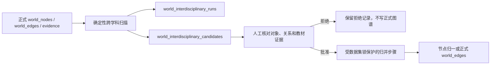

# 跨学科知识网络

更新日期：2026-07-13

状态：当前已实现功能与治理契约。

本文是跨学科功能的唯一专项说明。它描述当前代码、数据库、接口和人工复核工作台已经实现的行为，不把候选发现能力夸大为自动判定事实的能力。

## 一、目标与边界

跨学科功能解决两个问题：

1. 不同学科中出现的两个节点，是否可能指向同一个 Knowledge Object。
2. 分属不同学科的两个 Knowledge Object，是否可能存在值得人工确认的稳定关系。

系统采用“扫描候选、人工复核、归并写入”三段式治理流程：



以下行为被明确禁止：

- 扫描时直接创建正式关系。
- 因名称相似就自动合并节点。
- 把共享标签、主题词或领域画像当作关系成立的证据。
- 让前端绕过服务端直接修改正式知识表。
- 用 `same_as` 边代替真正的节点归一；同一对象批准后应合并身份。

## 二、候选类型

### 1. 同一知识对象候选

`candidate_kind=node_alignment` 表示两个跨领域节点可能是同一个 Knowledge Object。

扫描只比较领域集合互不重叠且 `kind` 相同的节点，并使用名称、别名、语义键和现有节点匹配评分生成候选。人工批准后，归并步骤复用正式节点去重逻辑：选择规范节点，迁移关系、证据、卡片、正文、领域画像和来源提及，记录旧节点到规范节点的映射，并把旧节点标为弃用。它不会额外创建一条 `same_as` 边。

### 2. 跨学科关系候选

`candidate_kind=relation` 表示两个跨领域节点可能存在关系。扫描要求节点领域集合互不重叠，并使用显式 `properties.bridge_tags`；没有显式桥接标签时，才回退到普通 `tags` 生成候选。已有正式边和已经进入同一对象候选的节点对不会重复生成关系候选。

关系候选默认使用 `related_to` 和无向关系，仅表示“值得复核”，不表示关系已经成立。批准时必须：

1. 从 `world-v1.2` 中除 `same_as` 之外的十四种关系类型中选择；`same_as` 只能通过同一对象候选执行节点归一。
2. 明确关系是无向、左侧指向右侧，还是右侧指向左侧。
3. 至少选择一条属于该候选、当前仍存在且未被标为合成、质量排除、待复核或已拒绝的教材证据。
4. 记录复核人；未填写时系统记为 `manual`，复核说明可选。

归并步骤写入正式关系时，会在 `world_edges.properties_json.interdisciplinary` 中保存候选编号、扫描运行编号、复核人、复核时间和证据编号。证据编号同时写入正式边的 `evidence_refs_json`。

## 三、发现信号不是事实证据

系统严格区分“召回信号”和“事实证据”：

| 信息 | 用途 | 能否单独证明关系成立 |
|---|---|---|
| 名称、别名、语义键 | 发现同一对象候选 | 不能 |
| 节点匹配评分 | 排序同一对象候选 | 不能 |
| 桥接标签、普通标签 | 发现关系候选 | 不能 |
| 学科领域 | 限定跨领域节点对、汇总覆盖 | 不能 |
| `world_evidence` 教材片段 | 人工判断并支撑正式关系 | 必须结合人工判断 |

当前扫描是确定性规则，不调用语言模型，也没有新增提示词。它擅长在可解释的候选集合中减少人工搜索成本，不负责语义蕴含判断、关系类型自动裁决或跨领域推理。

## 四、数据库与状态流转

新增两张治理表：

| 表 | 职责 |
|---|---|
| `world_interdisciplinary_runs` | 保存一次扫描的领域范围、阈值、统计、状态和时间 |
| `world_interdisciplinary_candidates` | 保存候选节点对、类型、分数、领域、证据、理由和复核结果 |

候选状态只能按下面的方向变化：

```text
pending -> approved -> applied
        \-> rejected
```

- `pending`：等待人工复核。
- `approved`：已批准，尚未写入正式图谱。
- `rejected`：已拒绝；保留记录，后续相同确定性候选编号不会反复出现。
- `applied`：归并步骤已经完成正式节点合并或关系写入。

默认重新扫描会替换同一数据集尚未复核的 `pending` 候选，但不会删除 `approved`、`rejected` 或 `applied` 历史。候选编号由候选类型和规范化节点对稳定生成；扫描运行编号另外包含唯一随机量，连续触发也不会冲突。

## 五、流水线与命令

一键教材流水线在正式节点归并、规范化、正文、教学画像及可选向量阶段之后执行 `interdisciplinary_analysis`，随后依次执行严格质检、图完整性检查和质量仪表盘。该阶段只生成候选，不写正式节点或关系。

单独扫描：

```bash
npm run interdisciplinary-analyze -w packages/pipeline -- \
  --dataset-id main \
  --db "$DATABASE_URL" \
  --pretty
```

常用可选参数：

- `--domains physics,chemistry`：只扫描指定领域。
- `--minimum-alignment-score 0.86`：同一对象候选最低分。
- `--minimum-relation-score 0.6`：关系候选最低分。
- `--maximum-candidates 500`：本次最多保存的候选数。
- `--maximum-bucket-size 80`：限制单个匹配桶规模，避免常见词造成组合爆炸。
- `--keep-pending`：保留现有待复核候选；默认替换。

批准候选后，单独执行归并：

```bash
npm run interdisciplinary-apply -w packages/pipeline -- \
  --dataset-id main \
  --db "$DATABASE_URL" \
  --pretty
```

`--limit` 可以限制一次处理的批准候选数。一键流水线支持 `--skip-interdisciplinary-analysis` 和 `--interdisciplinary-maximum-candidates`，但不会自动执行批准候选的归并。

## 六、服务端接口

| 接口 | 职责 |
|---|---|
| `GET /api/source/:key/interdisciplinary` | 返回领域覆盖、桥接节点、领域对、候选、证据摘要和最近扫描 |
| `POST /api/source/:key/interdisciplinary/analyze` | 启动一次候选扫描 |
| `POST /api/source/:key/interdisciplinary/candidates/:candidate_id/review` | 批准或拒绝待复核候选 |
| `POST /api/source/:key/interdisciplinary/apply` | 归并已批准候选 |

跨学科候选总数还会进入流水线质量仪表盘的人工待处理计数，避免候选只存在于专项页面而无人处理。

## 七、前端工作台

本地数据库模式下，主导航中的“跨学科”工作区提供：

- 领域、桥接节点、正式跨领域关系和候选状态概览。
- 扫描阈值、候选上限和待复核替换策略。
- 按状态、候选类型和领域对筛选。
- 两端节点的类型、定义、领域、候选理由和教材证据并排核对。
- 关系类型、方向、证据、复核人和说明编辑。
- 单项批准、拒绝，以及已批准候选的批量归并。
- 领域覆盖、领域对连接强度和多领域桥接节点浏览。

版本化的公开成果是只读快照，不连接 PostgreSQL，也不开放扫描、复核或归并功能。

## 八、事务与正式数据边界

跨学科扫描可以读取正式图谱，但只能写两张跨学科治理表。只有 `interdisciplinary-apply` 归并步骤可以修改正式节点和关系，并遵守以下约束：

1. 取得数据集级 PostgreSQL advisory lock。
2. 在同一事务中重新读取候选和正式数据。
3. 节点归一复用 canonical 节点合并实现，并重新映射依赖记录。
4. 关系写入前重新检查证据仍存在、关系类型仍合法。
5. 任一步失败时整体回滚，候选不会被错误标记为已应用。

lesson worker 的写入权限没有扩大：它仍然只能写 `world_lesson_runs` 和 `world_staging_*`。跨学科候选扫描与归并属于 canonical reducer 之后的治理流程。

## 九、当前限制

当前版本仍有明确限制：

1. 关系候选依赖人工维护或抽取得到的桥接标签，尚未引入向量召回或受约束的模型重排。
2. 名称相似和共享标签都不构成语义蕴含，系统不会自动证明关系正确。
3. 证据资格与编号归属校验只能证明证据可用于正式审核且来自候选上下文，不能自动证明证据语义足以支撑所选关系。
4. 领域统计采用严格跨领域口径：两个节点的领域集合有交集时，不计为跨领域节点对。
5. 工作台一次最多返回 500 条候选详情；总数和领域对待复核数由数据库全量聚合，不受展示上限影响。
6. 还没有形成多学科、多人裁决的金标准，因此候选准确率、漏检率和人工节省时间仍需正式实验评估。

这些限制是后续评测和迭代入口，不应通过自动写边或放宽证据要求绕过。
