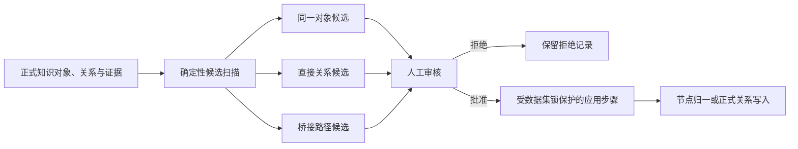

# 跨学科知识网络

更新日期：2026-07-13

状态：当前已实现功能与治理契约。

本文是跨学科功能的权威专项说明。它描述 `ai-nks-v0.2` 和 `world-v1.3` 已经落地的对象身份、桥接路径、证据审核、接口和正式写入边界。

## 一、目标

跨学科功能处理三个不同问题：

1. 两个不同学科节点是否实际指向同一个知识对象；
2. 两个不同学科知识对象之间是否存在一条有直接证据的稳定关系；
3. 两个对象是否能够通过一个更抽象的正式知识对象形成可解释的两段路径。

系统不把“导数—加速度”这类不同层次对象简单相连，而优先表达为：

```text
导数 ──形式化表达──> 变化率 ──应用于──> 加速度
```

“变化率”是正式知识对象，不是隐藏标签。每一段关系分别接受证据审核。

## 二、治理流程



扫描只写 `world_interdisciplinary_runs` 和 `world_interdisciplinary_candidates`。批准也不会立即改变正式图谱；只有独立应用步骤才能归并节点或写入 `world_edges`。

明确禁止：

- 扫描时直接创建正式关系；
- 因名称、标签或相似度接近就自动合并节点；
- 用主题标签代替关系证据；
- 用一条模糊关系跳过必要的桥接对象；
- 用已停用的 `same_as` 保留两个本应归并的身份；
- 让前端绕过服务端直接修改正式知识表；
- 为跨学科关系复制第二张正式关系表。

## 三、三类候选

### 1. 同一对象候选

`candidate_kind=node_alignment` 表示两端可能是同一知识对象。

扫描使用名称、别名、语义键、顶层形态和匹配分数召回候选。批准表示审核人确认“这是同一身份”，应用阶段会：

- 选择规范节点；
- 迁移关系、证据、卡片、正文、学科画像、课程投影和来源提及；
- 记录旧编号到规范编号的映射；
- 将旧节点标为弃用；
- 不创建“同一对象”关系。

### 2. 直接关系候选

`candidate_kind=relation` 表示两个不同学科对象可能存在一条稳定关系。

共享主题标签只用于召回。候选默认是“相关”和无向，表示尚待审核，不表示事实已经成立。批准时必须：

1. 从当前 18 类关系中选择中文关系名称；
2. 明确方向；
3. 至少选择一条符合来源策略、属于该候选且当前有效的直接证据；
4. 可记录审核人和审核说明。

### 3. 桥接路径候选

`candidate_kind=bridge_path` 表示“来源对象—桥接对象—目标对象”的两段路径。

桥接对象必须已经存在于 `world_nodes`，并满足至少一个条件：

- 具有语义桥、方法桥或类比桥角色；
- 适用范围是通用；
- 同时具有多个学科语义画像。

批准时两段都必须分别选择：

- 中文关系名称；
- 有向或无向；
- 至少一条直接证据。

证据必须属于它支持的那一段。第一段证据不能借给第二段使用，服务端会再次校验对象端点、关系、证据范围和证据现存状态。

## 四、中文关系选择

审核界面只展示中文关系名称。当前可选关系为：

```text
是一种、是实例、是组成部分、包含、具有属性、使用、产生、依赖、
是前置知识、导致、影响、表示、形式化表达、应用于、类似于、
建模描述、主题是、相关
```

服务端也接受这些中文名称并归一为稳定内部代码。内部代码只用于数据库、接口和程序判断，完整映射见 `docs/ai-nks-v0.2.md` 和 `packages/types/src/relations.ts`。

## 五、发现信号与事实证据

| 信息 | 用途 | 能否单独证明正式关系 |
|---|---|---|
| 名称、别名、语义键 | 召回同一对象候选 | 不能 |
| 对象匹配分数 | 排序候选 | 不能 |
| 主题标签、桥接标签 | 召回直接关系或桥接路径 | 不能 |
| 学科画像 | 判断学科覆盖和对象角色 | 不能 |
| 向量相似度 | 后续可用于扩大召回 | 不能 |
| 通过来源策略的现有证据 | 支撑人工关系判断 | 必须结合人工审核 |

当前扫描使用确定性规则，不调用语言模型。它减少人工搜索范围，不负责自动证明语义蕴含或裁决最终关系。

## 六、来源策略

证据不再被写死为“教材证据”。`world_source_policies` 当前管理六类来源：

- 教材；
- 学术论文；
- 百科资料；
- 课程标准；
- 结构化数据库；
- 专家知识。

每类来源具有可信等级、是否允许支持关系、是否要求额外人工确认等策略。候选审核只加载符合策略且未被标记为合成、质量排除、待确认或已拒绝的证据。

当前自动抽取主流程仍以教材为主；来源策略表示入库后的统一治理能力，不代表六类自动采集器都已完成。

## 七、数据库和状态

| 对象 | 职责 |
|---|---|
| `world_interdisciplinary_runs` | 保存一次扫描的学科范围、阈值、统计、状态和时间 |
| `world_interdisciplinary_candidates` | 保存三类候选、桥接对象、两段路径、证据、理由和审核结果 |
| `world_edges` | 唯一正式关系表；应用后的直接关系和桥接路径分段都写入这里 |
| `world_cross_domain_edges` | 从正式关系和对象学科画像推导出的只读跨学科视图 |

候选状态只能按以下方向变化：

```text
待审核 → 已批准 → 已应用
       ↘ 已拒绝
```

默认重新扫描会替换尚未审核的候选，不会删除已批准、已拒绝或已应用记录。候选编号由候选类型和对象路径稳定生成，扫描运行编号独立保存。

## 八、正式写入

应用步骤遵守以下约束：

1. 取得数据集级 PostgreSQL 咨询锁；
2. 在同一事务中重新读取候选、节点、关系和证据；
3. 同一对象候选复用正式节点归并逻辑；
4. 直接关系重新校验关系类型、方向和证据；
5. 桥接路径重新校验两段端点、逐段关系和逐段证据；
6. 新关系在 `properties_json.interdisciplinary` 中保存候选、扫描、审核人和审核时间；
7. 任一步失败时整体回滚，候选不会被误标为已应用。

桥接路径成功应用后会得到两个正式关系编号，并同时记录在候选的 `applied_edge_ids_json` 中。

## 九、流水线和命令

一键教材流水线在正式归并、规范化、正文、课程教学画像及可选向量阶段之后执行跨学科扫描。该阶段只生成候选。

单独扫描：

```bash
npm run interdisciplinary-analyze -w packages/pipeline -- \
  --dataset-id main \
  --db "$DATABASE_URL" \
  --pretty
```

常用参数：

- `--domains physics,chemistry`：限定学科；
- `--minimum-alignment-score 0.86`：同一对象最低分；
- `--minimum-relation-score 0.6`：关系和桥接路径最低分；
- `--maximum-candidates 500`：候选上限；
- `--maximum-bucket-size 80`：限制常见信号造成的组合数量；
- `--keep-pending`：保留已有待审核候选。

应用已批准候选：

```bash
npm run interdisciplinary-apply -w packages/pipeline -- \
  --dataset-id main \
  --db "$DATABASE_URL" \
  --pretty
```

一键流水线可以跳过候选扫描，但不会自动批准或应用候选。

## 十、服务接口

| 接口 | 职责 |
|---|---|
| `GET /api/source/:key/interdisciplinary` | 返回学科覆盖、桥接对象、学科对、候选、证据和最近扫描 |
| `POST /api/source/:key/interdisciplinary/analyze` | 启动候选扫描 |
| `POST /api/source/:key/interdisciplinary/candidates/:candidate_id/review` | 批准或拒绝候选；桥接路径逐段提交审核内容 |
| `POST /api/source/:key/interdisciplinary/apply` | 归并和写入已批准候选 |

候选总数进入流水线质量仪表盘的人工待处理计数。

## 十一、审核工作台

“跨学科”工作区提供：

- 学科、桥接对象、正式跨学科关系和候选状态概览；
- 扫描阈值、候选上限和替换策略；
- 按状态、候选类型和学科对筛选；
- 两端对象以及桥接对象的定义、类型和学科并排核对；
- 中文关系和方向选择；
- 直接关系的证据选择；
- 桥接路径两段关系和证据的独立编辑；
- 单项批准、拒绝和已批准候选批量应用。

版本化公开成果是只读快照，不开放扫描、审核或应用功能。

## 十二、当前限制

1. 候选召回仍主要依赖身份信号、显式桥接对象和主题标签，尚未引入受约束的模型重排。
2. 来源资格和证据编号校验不能自动证明语义蕴含。
3. 自动抽取主流程目前仍以教材为主，其他来源采集器尚未形成完整闭环。
4. 两端学科集合有交集时，不计为严格跨学科对象对。
5. 工作台为流畅性限制单页候选详情数量，数据库统计不受该限制。
6. 尚未形成多学科、多人裁决的金标准，因此召回率、准确率和人工节省时间仍需正式实验评估。
